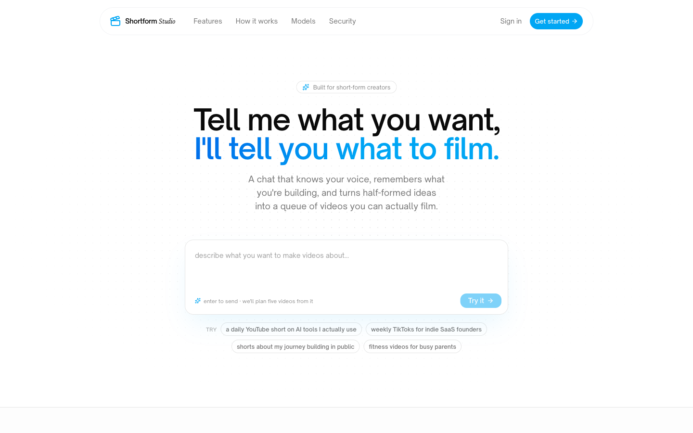

# 🎬 shortform-studio



Most AI script tools are blank chat boxes wearing a logo. Shortform Studio ships with the playbook: hook archetypes, retention mechanics, video format templates, and niche-specific tactics, all loaded as system context on every turn. Paste an idea, get a script that respects how short-form actually works. Built for the creator who's seen the gurus, read the threads, and still doesn't know what to post tomorrow morning.

The knowledge layer at `src/lib/patterns/pattern-library.md` is the entire competitive moat, and it's right there. Fork it, read the prompt, change the playbook.

Pre-alpha, scaffolding stage, expect breakage.

## 🧠 What's baked in

- **Hook archetypes** — controversial take, counterintuitive claim, before/after tease, question loop, pattern interrupt, and more, with the structural rule and an example for each.
- **Video formats** — the canonical short-form shapes (talking head, listicle, voiceover, narrative arc) with retention notes for each.
- **Retention mechanics** — open loops, callbacks, escalation, payoff timing.
- **Niche playbooks** — what works for fitness vs. business vs. educational vs. entertainment.

The model gets all of this on every turn. You don't have to teach it short-form from scratch.

## 🔓 Open source

MIT. Read every prompt, change every rule. Pin the version, fork the repo, ship your own opinionated build. The interesting part is in `src/lib/patterns/`, not in some vendor's API.

## 🔑 Bring your own key

Anthropic, OpenAI, Gemini, Grok, or Llama via Groq. Your key, your spend, your data. Keys are AES-256-GCM encrypted at rest, decrypted only inside the request that calls your provider. We don't proxy.

## 🧱 Stack

- Next.js 16 (App Router) + React 19 + TypeScript
- Tailwind v4 + shadcn/ui + Base UI primitives + motion/react
- Supabase (Postgres, Auth, Storage, Realtime, RLS)
- Vercel AI SDK v6 with provider adapters for Anthropic, OpenAI, Google, xAI, Groq

## ✅ Prerequisites

- **Node.js 20+** and **npm** (the lockfile is `package-lock.json`, don't switch package managers).
- A free **Supabase** account and project.
- One **provider API key** for whichever model you want to drive chat with. You add this in-app at `/settings` after first login, not in env vars.
- Optional: the **Supabase CLI** (`brew install supabase/tap/supabase`) if you want to apply migrations from the terminal instead of pasting SQL.

## 🚀 Local setup

### 1. Clone and install

```bash
git clone https://github.com/aflekkas/shortform-studio
cd shortform-studio
npm install
```

### 2. Create a Supabase project

1. Go to [supabase.com](https://supabase.com), create a new project (free tier is fine), pick any region.
2. Wait for it to provision, then open **Project Settings → Data API** and copy the **Project URL**.
3. Open **Project Settings → API Keys** and copy:
   - the **publishable / anon** key (browser-safe)
   - the **secret / service-role** key (server only, treat like a password)

### 3. Apply the database migrations

Migrations live in `supabase/migrations/` and must be applied in order. Pick one of the two paths.

**Option A — Supabase CLI (recommended)**

```bash
supabase login
supabase link --project-ref YOUR-PROJECT-REF
supabase db push
```

`YOUR-PROJECT-REF` is the subdomain of your project URL (`https://YOUR-PROJECT-REF.supabase.co`).

**Option B — SQL Editor in the dashboard**

Open each file in `supabase/migrations/` in numeric order (`0001_init.sql` → `0017_starter_prompts.sql`), paste it into **Supabase Studio → SQL Editor**, and run it. Don't skip any, the later migrations depend on earlier tables.

### 4. Generate the BYOK encryption master key

User provider keys are encrypted at rest with AES-256-GCM. The master key is 32 random bytes, base64-encoded:

```bash
openssl rand -base64 32
```

Keep this value stable. If you ever rotate it, every existing encrypted row becomes unreadable, so plan for a re-encryption migration.

### 5. Configure environment variables

```bash
cp .env.local.example .env.local
```

Fill in:

| Variable | Where it comes from |
| --- | --- |
| `NEXT_PUBLIC_SUPABASE_URL` | Supabase → Project Settings → Data API |
| `NEXT_PUBLIC_SUPABASE_PUBLISHABLE_KEY` | Supabase → Project Settings → API Keys (publishable / anon) |
| `SUPABASE_SECRET_KEY` | Supabase → Project Settings → API Keys (secret / service-role) |
| `BYOK_ENCRYPTION_KEY` | output of the `openssl rand -base64 32` command above |
| `CRON_SECRET` | optional, only if you wire up the daily starter-prompts cron |

`.env.local` is gitignored. Never commit secrets.

### 6. Run it

```bash
npm run dev
```

Open [http://localhost:3000](http://localhost:3000).

## 👤 First-run flow

1. **Sign up** with email + password. Supabase Auth handles confirmation; in dev, check the Supabase dashboard's **Authentication → Users** tab if you don't see the email.
2. **Add a provider key** at `/settings`. Pick Anthropic / OpenAI / Google / xAI / Groq, paste your key, choose a model. The key is encrypted with `BYOK_ENCRYPTION_KEY` before it ever hits the database.
3. **Onboarding** asks for your niche, platform, audience stage, and goals. This goes into the system prompt alongside the pattern library.
4. **Start a chat** from the cockpit. The model is grounded in `pattern-library.md` and your profile on every turn.

If you skip step 2 the chat route returns `402 missing_key` and the UI shows a banner linking back to settings.

## 🧪 Verification

```bash
npm run lint    # most edits
npm run build   # routing / data / framework changes
npm run test    # vitest, currently a thin smoke layer
```

`npm run dev` is for active development; don't leave it running for verification.

## 🧰 What's in here

- `src/app/(dashboard)` — cockpit shell, auth-gated.
- `src/app/api` — chat, onboarding, hooks, search, memory, cron, attachments.
- `src/components/cockpit` — brand panel, video queue, chat switcher, topbar.
- `src/components/chat` — chat surface + input.
- `src/components/ui` — shadcn / Base UI primitives.
- `src/lib/patterns/pattern-library.md` — **the playbook**.
- `src/lib/anthropic.ts` — system prompt + pattern-library injection.
- `src/lib/providers.ts` — provider + model catalogue, single source of truth.
- `src/lib/model-dispatch.ts` — resolves the right AI SDK adapter at request time.
- `src/lib/crypto.ts` — AES-256-GCM helpers for BYOK at rest.
- `src/lib/supabase` — server + browser Supabase clients.
- `src/lib/db/queries.ts` — shared DB query layer.
- `supabase/migrations` — SQL schema, applied in numeric order.
- `scripts/seed-byok-key.mjs` — dev helper that seeds an encrypted Anthropic key for a given user, useful when you want to skip the `/settings` flow during local testing.

## 🛠️ How it works

The chat route loads `pattern-library.md` and injects it as a system message on every turn alongside your creator profile (niche, platform, audience stage, goals). The model is instructed to ground every recommendation in the library — when it invokes a hook archetype or retention mechanic, it names it from the playbook so you build the vocabulary over time. Per-user keys live encrypted in `user_provider_keys`; the chat dispatch in `src/lib/model-dispatch.ts` resolves the right provider SDK at request time. Token usage is recorded per user against the user's own key, since each user pays for their own spend.

## ⏰ Optional: starter-prompts cron

`vercel.json` schedules `/api/cron/starter-prompts` daily at 09:00 UTC to refresh the suggested prompts. The route requires `Authorization: Bearer $CRON_SECRET`. If you deploy to Vercel, set `CRON_SECRET` in the project's environment and Vercel Cron will hit the route automatically. If you self-host, point any scheduler at the same URL with the same header.

## ▲ Deploying to Vercel

1. Push your fork to GitHub.
2. Import the repo on Vercel.
3. Add the same env vars from `.env.local` to **Project Settings → Environment Variables** (production + preview).
4. Deploy. Vercel will pick up `vercel.json` for the cron schedule.

For other hosts: anything that runs Next.js 16 server output works. You need to expose the four env vars and the migrated Supabase project.

## 🔒 Security notes

- `SUPABASE_SECRET_KEY` and `BYOK_ENCRYPTION_KEY` are server-only. Never reference them from a client component.
- User provider keys are never returned to the client after they're stored. The `/settings` UI shows the last 4 chars only.
- Row Level Security is on for every user-owned table (`0008_rls_auto_enable_lockdown.sql`). Keep it that way; the publishable key relies on it.
- Don't log decrypted provider keys, even in development.

## 📄 License

MIT
